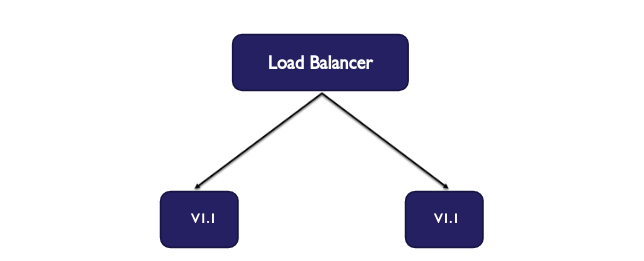

# What are Rollig-Deployments ?
A rolling deployment is a deployment pattern (also known as an Incremental deployments, Batched deployments, or Ramped deployment) where new version is delivered, usually to one or more deployment targets at a time, untill all the targets have the updated version.

A typical process looks something like this:

* With two nodes running ```v1.0``` of your application, drain the first node to be updated, take it out of the load balancer pool and leave the remaining node to online to serve traffic.


* Stop the ```v1.0``` application from the running on the drained node, then deploy the new ```v1.1``` version. 


* After the first node has updated successfully, proceed with draining the remaining node which still running ```v1.0``` of your application, while your new ```v1.1``` version is now online serving traffic.


* Stop the ```v1.0``` application on the remaining node from running, deploy the ```v1.1``` version. 


* Finally after ```v1.1``` of your application has been deployed successfully to all of your nodes, and now your deployment is complete.


